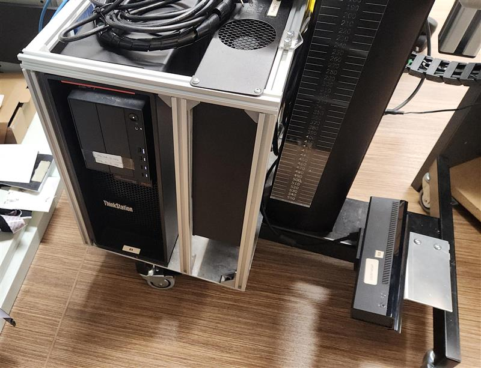

# TherapyRepo

## Introduction

Hello. 

This repository serves the purpose of unifying and guiding through all of the previous work done by the NRM group in the University of Queensland regarding the project and funcionality of the industrial robot () to be used as a collaborative robot to aid in motor therapy for people that have suffered any type of sickness that could impair their upper limbs movement.

My name is Alejandro Hernandez De la Torre. 
In case you have any doubt with this repository or any consultation please contact me in my personal email alexhdlt@hotmail.com  or tell my supervisor Alejandro Melendez.

## First steps

### Setup of the Computer

The first steps that need to be taken into account for the use of the robot is that a computer needs to be setted up. The laboratory computers especifically the ones that are already held in place with a square rig have all the previous data needed. Look especifically for a thinkerpad that has a label with a barcode with the numbers 4004/08144/000. That computer holds all the data that was used for this project and previous ones.

In case you are not in the medical robotics laboratory or the computers are no longer there you should have a computer with Ubuntu 18.04 LTS installed, also you need ROS 1 (Melodic).

In case you are in the robotics laboratory you need to setup an ethernet connection with the IT Desk Help Department.  

### Setup of the Robot

You need to install the franka-emika robot package for the use of the robot. This is **vital**. Since their software is licensed, we only have the copies that are installed on the computers. **Don't erase them or try to modify them.** Also it must be noted that Franka-Emika robotics has discontinued this model of the robot and acquiring pieces or software is going to be extremly complicated. Please bear that in mind.

The guide to setup all the different components of the robot can be found on the follwing links:

- User Manual: https://download.franka.de/documents/100010_Product%20Manual%20Franka%20Emika%20Robot_10.21_EN.pdf
- Franka Control Interface : https://frankarobotics.github.io/docs/index.html

Both of the guides should be self-explanatory and they will guide you through the full setup and any future issues you may encounter. 

### Setup and Specific cases for the UQ - Medical Lab

Since everything is already installed in the computer lab you need to make sure that you follow these steps.

- You have access to the User Medical Robotics
- You have internet access in the computer 
- All connections to the robot are correct as showed in the user manual.  
- Setup the ether connection in the connection settings in Ubuntu. 
All robots have a label in the front of their base that show you which IP direction you should configure your connection.
- Open the terminal and see if you are capable of connecting to the robot via ping.

