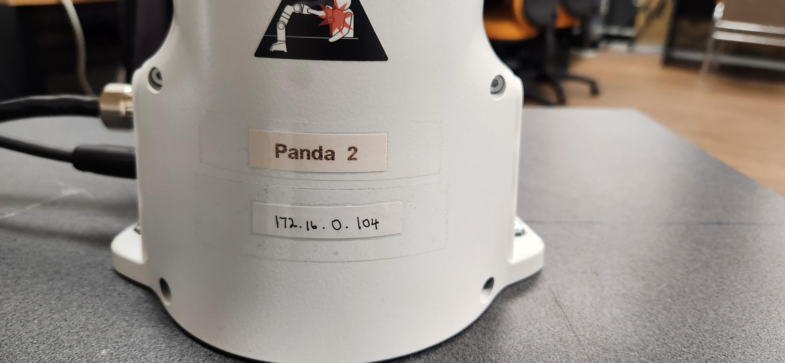

# TherapyRepo

## Introduction

Hello. 

This repository serves the purpose of unifying and guiding through all of the previous work done by the NRM group in the University of Queensland regarding the project and funcionality of the industrial robot () to be used as a collaborative robot to aid in motor therapy for people that have suffered any type of sickness that could impair their upper limbs movement.

My name is Alejandro Hernandez De la Torre. 
In case you have any doubt with this repository or any consultation please contact me in my personal email alexhdlt@hotmail.com  or tell my supervisor Alejandro Melendez.

## First steps

### Setup of the Computer

The first steps that need to be taken into account for the use of the robot is that a computer needs to be setted up. The laboratory computers especifically the ones that are already held in place with a square rig have all the previous data needed. Look especifically for a thinkerpad that has a label with a barcode with the numbers 4004/08144/000. That computer holds all the data that was used for this project and previous ones.

In case you are not in the medical robotics laboratory or the computers are no longer there you should have a computer with Ubuntu 18.04 LTS installed, also you need ROS 1 (Melodic).

In case you are in the robotics laboratory you need to setup an ethernet connection with the IT Desk Help Department.  

### Setup of the Robot

You need to install the franka-emika robot package for the use of the robot. This is **vital**. Since their software is licensed, we only have the copies that are installed on the computers. **Don't erase them or try to modify them.** Also it must be noted that Franka-Emika robotics has discontinued this model of the robot and acquiring pieces or software is going to be extremly complicated. Please bear that in mind.

The guide to setup all the different components of the robot can be found on the follwing links:

- User Manual: https://download.franka.de/documents/100010_Product%20Manual%20Franka%20Emika%20Robot_10.21_EN.pdf
- Franka Control Interface : https://frankarobotics.github.io/docs/index.html

Both of the guides should be self-explanatory and they will guide you through the full setup and any future issues you may encounter. 

### Setup and Specific cases for the UQ - Medical Lab

Since everything is already installed in the computer lab you need to make sure that you follow these steps.

- You have access to the User Medical Robotics
- You have internet access in the computer 
- All connections to the robot are correct as showed in the user manual.  
- Setup the ether connection in the connection settings in Ubuntu. 
All robots have a label in the front of their base that show you which IP direction you should configure your connection.

- Open the terminal and see if you are capable of connecting to the robot via ping.
- After the previous point was succesful, type the IP adress in any web browser (In my own experience Chrome works the best), to connect to the Robot Emika Desktop Interface.
- Try using the block interface to move the robot. When you succesfully finish that, enter to the FCI mode and try connecting with ROS. 
- Try running the examples included with the robot.

## Previous Work
Since everything is already working, we need to move on to the various ROS Workspaces and their funcionality. We need to explain all of the branches since their components are important for the funcionality of the project in general.

### Shanker Dorairajan 
His work is important because he started developing a real-time UL joint angle estimation algorithm. These estimations are made using OpenPose, Microsoft Kinect V2. His project also explored the implementation of a rehabilitation training model to assist the patient when necessary. This was possible because he combined the impedance controller of the robot with an interface to record trajectories and do them in real timne. He also developed a Ros Workspace to access these functions. Typing the command **placeholder** on the terminal will allow you to access this funcionality. You need to have the Microsoft Kinect V2 connected to make use of this funcionality.

These images will change with real screenshots of the program running

## My own Work

### RTS IMPLEMENTATION

To achieve better results with the future and current usage of the robot I decided that it was a good idea to try and establish a good Real time kernel. 
- First I tried using Ubuntu PRO, but since the lab computer uses Ubuntu 18.04 and this official kernel was not compatible I decided to use a generic kernel. In this case 5.14-rts. This kernel enables us to use realtime systems for better performance of the computer. 

The only downside when using computer vision it's that Nvdia Drivers are not compatible with these kinds of kernels. An outstanding workaround was found on this github repository: 

With this in mind we could generate a good result and actually install NVdia Drivers 

An screenshot of introducing the commando nvdia-smi working on an RTS kernel

### Gravity compensation

### ROS 2 Implementation

